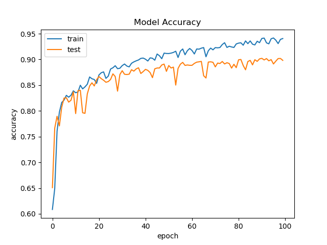
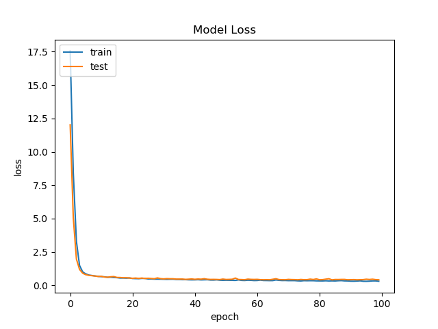
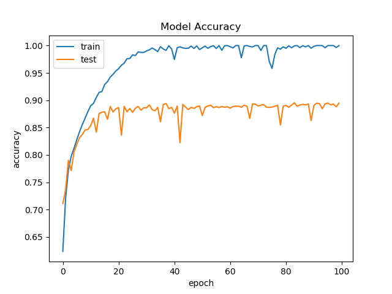
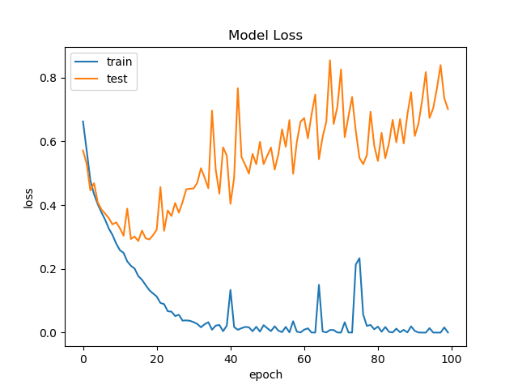

# FAKE NEWS DETECTION USING HIERARCHICAL ATTENTION NETWORKS

## Data setup

- run ```./gather_data_training.sh``` to get Embedding Vectors, Training Data Files and the Tokenized Word Index

- This will even download a Video File which displays the entire execution of the model. To run ```./gather_data_training.sh```,  ```wget``` needs to be a part of the system. Ubuntu 16.04 is the ideal environment. 

## Environment Setup

- ```pip install -r req.txt```


## Training : 

- Dataset Used : split-3.csv : Contains 22000 Documents of Labels : FAKE_NEWS and REAL_NEWS

- Running ```python main.py``` will initate the training process for the LSTM,HAN and 3HAN models. It will save the Models in the ```models``` folder and the plots int the ```plots``` folder. 


## Testing 

- ```python predict.py```

# Instructions : 

- The models provided in the Models folder can be run using the predict API. But there the output will not be what is provided in the presentation. To get the accuracy and the outputs mentioned in the presentation, please Train the models again using ```python main.py```. The logs display the accuracy of the model post the training processes against a test dataset. 

- While we were saving the model we are facing a well known issue of Keras. Even though the model is saved it doesn't behave in the way it is supposed to. Even if passed with the same data it is trained with, the model doesn't yield the same accuracy which it yielded when the same model is run through the test dataset just after training. To validate the issues that we are proposing , Please find below the links on Keras's github thread where multiple users are reporting the same issues with the model. 

    - https://github.com/keras-team/keras/issues/4875

    - https://github.com/keras-team/keras/issues/4904

- To View the full capabilities of the Model, Please retrain the Model and the logs contain the accuracy and the loss of the model. The video that gets downloaded via ```gather_data_training.sh``` show cases a model training session for the HAN. 

## Best Results From Training : 

### HAN 
- ACCURACY
- 

- LOSS
- 

### LSTM
- ACCURACY
- 

- LOSS
- 

## Inference

The 3 LSTM is overfit, But even with regularization and drop out the overfitting doesn't seem to go. The LSTM's predictions are also less accurate than the HAN